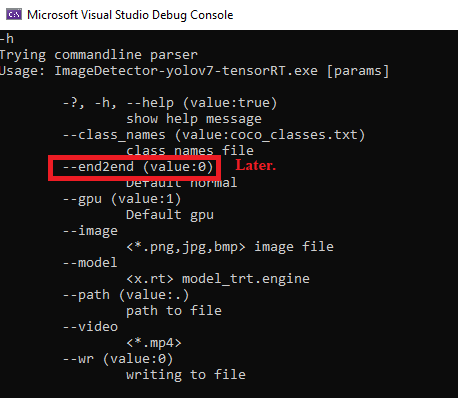

### Object-Detection-Yolov7-TensorRT-Nvidia
Yolov7 Deep MI TesorRT model process with Nvidia DNN C++ in Windows 10.<br>
Deep-learning Machine Intelligence Network.<br>
Base is [Yolov7](https://github.com/WongKinYiu/yolov7)<br>
TensorRT model format description using for the IoT device: [NVIDIA TensorRT](https://developer.nvidia.com/tensorrt).<br>

<br>
If you compiled embedded Linux, it is used for IoT + Camera, example: [Jetson modules](https://developer.nvidia.com/embedded/jetson-modules).<br>
<br>
[OpenCV office](https://opencv.org/)<br>

## Enviroment
- Windows 10 64-bit<br>
- NVIDIA Geforce GTX 960 2 Gbyte RAM<br>
- Microsoft Visual Studio Community 2022<br>
- [TensorRT-8.5.2.2](https://developer.nvidia.com/nvidia-tensorrt-8x-download):<br>
  c:\Program Files\NVIDIA GPU Computing Toolkit\TensorRT-8.5.2.2\ <br>
- [CUDA Toolkit v11.8](https://developer.nvidia.com/cuda-11.0-download-archive?target_os=Windows&target_arch=x86_64&target_version=10&target_type=exelocal):<br>
  c:\Program Files\NVIDIA GPU Computing Toolkit\CUDA\v11.8\ <br>
-  [cudnn-8.7.0.84](https://developer.nvidia.com/rdp/cudnn-archive):<br>
   c:\Program Files\NVIDIA GPU Computing Toolkit\cudnn-windows-x86_64-8.7.0.84_cuda11\ <br>
## Installation <br>
   Downloading opencv files, there files are archive:<br> 
   [opencv-4.6.0.zip](https://drive.google.com/file/d/1uWIsNRLDC2nySC84gMAdWEqElQTZmwQR/view?usp=share_link) include, library, binary dll files. <br> 
   unzip and copy to ./3rdparty and .x64/vc17/bin dll files to copy to .x64/Debug and x64/Release directory.  <br> 
   
## Building the ImageDetector-yolov7-tensorRT VS2022 project
``` shell
-VS2022 started.
-"Open a project or solution".
-in Browse to search the "ImageDetector-yolov7-tensorRT.sln" file, and it open that.
-Build->Build Solution (F7).
Builded in "./x64/Release/ImageDetector-yolov7-tensorRT.exe".
```
## Running the "ImageDetector-yolov7-opencv.exe" app.<br>
Program arguments: <br>
<br>
Examples:
Image:<br>
``` shell
ImageDetector-yolov7-tensorRT_image1.bat
```
Result image:<br>
<br>
Video:<br>
``` shell
ImageDetector-yolov7-tensorRT_video1.bat
```
Result video:<br>
YouTube video (click):<br>
<div align="center">

[](https://www.youtube.com/watch?v=3lF0VBBGiOo)

</div><br>

### Conversion *.onnx model to *.tr model:
``` shell
yolov7:
python export.py --weights yolov7-tiny.pt --grid --simplify // --end2end later
cd c:\Program Files\NVIDIA GPU Computing Toolkit\TensorRT-8.5.2.2\bin\
trtexec.exec --onnx=yolov7-tiny.onnx --saveEngine=yolov7-tiny.trt --fp16 //conversion
trtexec --loadEngine=yolov7-tiny.trt //tested, checked
```
The model conversion and system of TensoRT version need equal !! <br> 
Current is version number\: 8.5.2.2  <br>
### Python

show in `python/Example_tr_detect.ipynb` <a href="https://github.com/ptiszai/Object-Detection-Yolov7-TensorRT-Nvidia/tree/main/python/Example_tr_detect.ipynb"></a>